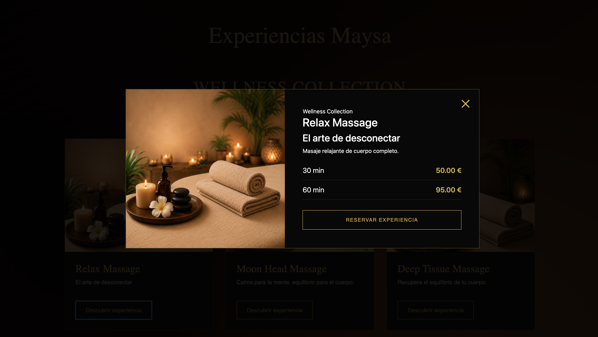
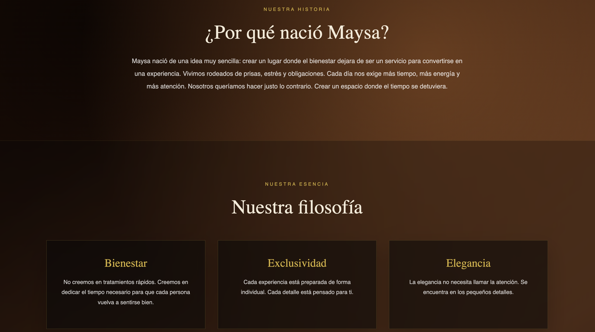
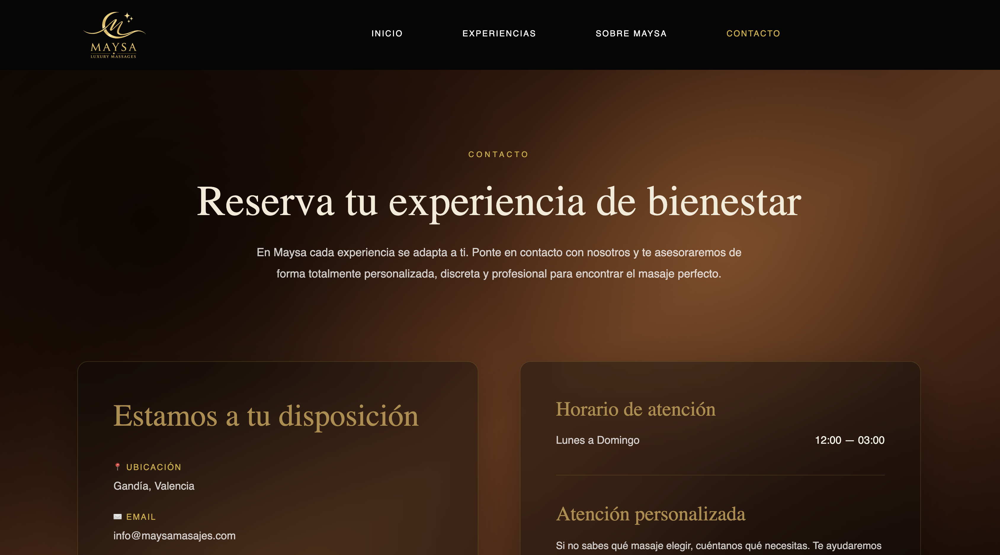

<div align="center">

# ✨ Maysa Luxury Massages

### Full Stack Luxury Wellness Website

A production-ready Full Stack web application built with **Angular** and **Symfony** for a real luxury wellness business.

<p>


</p>

</div>

---

# 🌐 Project Information

| | |
|:---|:---|
| **Status** | 🟢 Production |
| **Live Demo** | https://maysamasajes.com |
| **Frontend** | Angular 20 |
| **Backend** | Symfony 7 |
| **Database** | MariaDB |
| **Deployment** | IONOS (Apache) |

---

# 📸 Gallery

## Home

<p align="center">

</p>

---

## Experiences

<p align="center">

</p>

---

## Massage Detail

<p align="center">

</p>

---

## About Maysa

<p align="center">

</p>

---

## Contact

<p align="center">

</p>

---

# 🚀 About the Project

Maysa Luxury Massages is a **production-ready Full Stack web application** developed for a real luxury wellness business.

The project was designed from scratch with the objective of creating an elegant, modern and immersive website while implementing a clean architecture using **Angular** as the frontend and **Symfony** as the backend through a REST API.

The application is currently deployed in a production environment and focuses on:

- Premium user experience
- Responsive design
- Clean architecture
- Performance
- Maintainability
- Scalability

---

# ⭐ Highlights

- 🌐 Live in production
- ⚡ REST API
- 📱 Fully responsive
- 🎨 Custom luxury UI
- 💬 WhatsApp booking integration
- 🔍 SEO optimized
- 🚀 Angular + Symfony architecture

---

# ✨ Main Features

## User Experience

- Elegant luxury-inspired interface
- Fully responsive layout
- Interactive massage detail modal
- Smooth navigation
- Contact page
- About page

## Business Features

- Dynamic massage collections
- Dynamic pricing system
- WhatsApp booking
- Professional presentation

## Technical Features

- Symfony REST API
- Doctrine ORM
- MariaDB database
- SEO configuration
- Production deployment

---

# 🏗 Architecture

```text
                Angular 20
                     │
          HTTP Client / REST
                     │
             Symfony 7 API
                     │
             Doctrine ORM
                     │
                MariaDB
```

---

# 🛠 Tech Stack

## Frontend

- Angular 20
- TypeScript
- HTML5
- CSS3
- Responsive Design

## Backend

- Symfony 7
- PHP 8.2
- Doctrine ORM
- REST API

## Database

- MariaDB

## Development Tools

- Git
- GitHub
- Docker
- Postman
- PhpStorm
- Visual Studio Code

## Deployment

- Apache
- IONOS Hosting
- SFTP

---

# 📂 Project Structure

```text
maysa
│
├── maysa/             # Symfony Backend
│
├── maysaFront/        # Angular Frontend
│
├── database/          # SQL Dump
│
└── README.md
```

---

# 📱 Responsive Design

The application has been carefully optimized for:

- Desktop
- Laptop
- Tablet
- Mobile

Responsive components include:

- Navigation Bar
- Hero Section
- Experience Cards
- Massage Modal
- Collections
- Contact Page
- Footer

---

# 🔗 REST API

The Angular frontend communicates with the Symfony backend through a REST API.

### Example Endpoints

```http
GET /api/massage
GET /api/massageCollection
GET /api/complement
```

---

# ⚙️ Installation

## Clone Repository

```bash
git clone https://github.com/Lokhy87/maysa.git
```

---

## Frontend

```bash
cd maysaFront

npm install

ng serve
```

Runs on:

```text
http://localhost:4200
```

---

## Backend

```bash
cd maysa

composer install

symfony serve
```

Runs on:

```text
http://127.0.0.1:8000
```

---

# 📈 Future Improvements

- User authentication
- Online booking system
- Administration dashboard
- Availability calendar
- Online payments
- Customer reviews
- Email notifications

---

# 👨‍💻 About Me

**Alberto**

Junior Full Stack Developer

Passionate about building modern Full Stack web applications using **Angular**, **Symfony** and **PHP**.

Currently expanding my portfolio through real-world projects focused on clean architecture, responsive design and production deployment.

---

# 📄 License

This project is available under the MIT License.

---

<div align="center">

## 🌐 Live Demo

### https://maysamasajes.com

⭐ If you enjoyed this project, consider leaving a star!

</div>